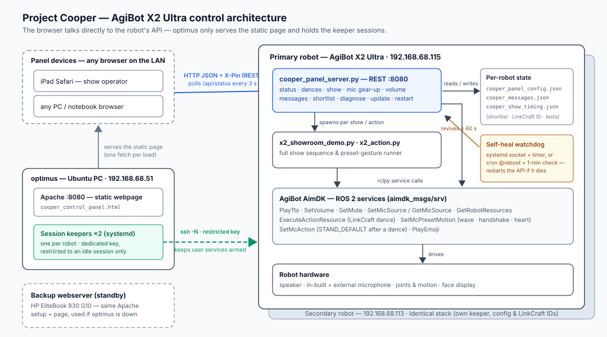

# Project Cooper — Architecture & API Reference

How a tap on the iPad becomes a robot action, layer by layer, and the
full contract of the control API in between.

## A. The layers



```
┌─────────────────────┐   HTTP GET (page load only)
│  iPad / PC browser  │◄───────────────────────────────┐
│  (Safari, Edge, …)  │                                │
└─────────┬───────────┘                     ┌──────────┴──────────┐
          │                                 │  optimus (Ubuntu PC)│
          │  HTTP/JSON + X-Pin header       │  192.168.68.51:8080 │
          │  (fetch from the page's JS,     │  Apache, serves ONE │
          │   polls /api/status every 3 s)  │  static file:       │
          ▼                                 │  cooper_control_    │
┌──────────────────────────────────────────┐│  panel.html         │
│  Robot — control API middleware          │└─────────────────────┘
│  cooper_panel_server.py  :8080           │
│  (Python stdlib HTTP server + rclpy)     │   The page is dumb
│                                          │   hosting: after load,
│  • REST endpoints (section C)            │   the browser talks
│  • per-robot config/message files (E)    │   ONLY to the robot.
│  • launches show/gesture subprocesses    │
└───────┬──────────────────┬───────────────┘
        │ ROS2 service     │ subprocess
        │ calls (rclpy)    │ (per request)
        ▼                  ▼
┌─────────────────┐  ┌─────────────────────────────┐
│  AgiBot AimDK   │  │ x2_showroom_demo.py  (show) │
│  ROS2 services  │◄─┤ x2_action.py      (gesture) │
│  (section D)    │  │  — also rclpy → AimDK       │
└───────┬─────────┘  └─────────────────────────────┘
        ▼
┌─────────────────┐
│  X2 robot HW:   │   TTS/audio, LinkCraft dances,
│  speakers, mic, │   preset motions, face display,
│  motion control │   microphone array
└─────────────────┘
```

Key property: **optimus only hosts the webpage.** Every command goes
straight from the browser to the robot's API — optimus being down does
not affect a panel that is already open, and the same page file can be
opened from a folder at events with no webserver at all.

There are two robots (primary and secondary, both configurable in the
panel's Settings — e.g. 192.168.68.115 and 192.168.68.113). Each runs its own identical API and keeps its own
config files; the panel's Active-robot selector just changes which base
URL the browser talks to.

## B. Transport, authentication, resilience

- **Transport**: plain HTTP, JSON bodies, on the robot's port 8080.
  CORS is open (`Access-Control-Allow-Origin: *`, OPTIONS preflight
  handled) because the page's origin is optimus, not the robot.
- **Authentication**: every POST requires the panel PIN in the
  **`X-Pin` header** (constant-time comparison server-side; 401 on
  mismatch). GETs are read-only and unauthenticated. The PIN is set at
  install time (`--pin` / `COOPER_PANEL_PIN`).
- **Liveness**: the page polls `GET /api/status` every 3 s; the
  status bar turns red and controls lock when polls fail. With the
  systemd-socket install, the connection attempt itself starts the API
  (socket activation); watchdogs on the robot (cron entry or systemd
  user timer, once per minute) revive it after crashes or lockouts.
- **Version guard**: the page (`PANEL_VERSION`) and the API
  (`SERVER_VERSION`, reported by `/api/status`) are bumped in lockstep;
  the page shows an amber "page ≠ API" tag when they differ.

## C. REST API of the robot middleware

All bodies and responses are JSON. Every response carries `"ok": true`
or `"ok": false` with an `"error"` string.

### Read (GET, no PIN)

| Endpoint | Returns |
|---|---|
| `/` | Identification blurb (the page itself lives on optimus). |
| `/api/status` | `version`, `listening` (true/false/null = unknown), `speaker`, `volume`, `mic_geared`, `mic_source` (1 in-built / 2 external / null, last verified), `show_running`, `event_running`, `pin_required`, `library_size`, `new_songs`, `show_timing` (live show milestones). Polled every 3 s. |
| `/api/health` | `checks`: list of `{id, label, ok(true/false/null=warn), detail, fix}` — the 🩺 Diagnose checklist (API process, start-after-reboot, AimDK services, files, PIN, …). |
| `/api/dances` | `dances`: `[{key, name, version, duration, is_new}]` — live LinkCraft library. `key` is the LinkCraft resource ID (per robot!), `name` the human title, `duration` the measured song length in s or null. |
| `/api/shortlist` | `shortlist` (ticked keys), `times` (`{key: seconds}`, 999 = full song), `show_dance` (the configured dance key). |
| `/api/messages` | `active` group name + `groups`: `{name: {guestName, greetAM, greetPM, introMsg, thankYouMsg, goodbyeMsg}}` — this robot's message store. |
| `/api/actions` | `actions`: `[{key, label, emoji}]` for the gesture dropdown. |
| `/api/event` | `opening` (action key), `message`, `closing` (action key) — this robot's pre-configured event — plus `event_running`. |

### Control (POST, PIN required via `X-Pin`)

| Endpoint | Body | Effect |
|---|---|---|
| `/api/listening` | `{"listen": bool}` | Mic on/off via `SetMute`. Turning ON first silently normalizes the mic source back to in-built (volume-0-wrapped) and clears the geared flag. |
| `/api/speaker` | `{"on": bool}` | Speaker on/muted via `SetVolume` (muted = 0, on = last level). |
| `/api/volume` | `{"level": 0-100}` | Speaker volume. |
| `/api/gear_up` | `{"external": bool}` | Performance prep: volume 0 → switch mic source → 5 s settle → volume 70. The switch is **verified** via `GetMicSourceRequest` (retry once, honest failure). 409 while a show runs. |
| `/api/dance` | `{"key": "…"}` (optional) | Start a LinkCraft dance now (defaults to the configured show dance). |
| `/api/action` | `{"action": "shake_hand" \| …}` | One gesture, executed by the standalone `x2_action.py`. 409 while a show runs. |
| `/api/show` | `{"unmute_after": bool}` (texts optional — see below) | Launches `x2_showroom_demo.py`. Refuses (400) when no show dance is configured on this robot or the configured key is not in this robot's library. |
| `/api/shortlist` | any of `shortlist`, `times`, `show_dance` | Save the per-robot dance settings. |
| `/api/messages` | `{"active": name, "groups": {...}}` | Replace this robot's message store (sanitized: ≤20 groups, field whitelist, 500-char texts). |
| `/api/event_config` | `{"opening": key, "message": text, "closing": key}` | Save this robot's event (each part optional; action keys validated, message ≤1000 chars). |
| `/api/event` | `{}` | Play the pre-configured event via `x2_event.py`: opening gesture → message (TTS) → closing gesture. The mic is muted while the message plays (unless geared up) and restored after. 400 when nothing is configured; 409 while a show or another event runs. |
| `/api/songs_seen` | `{}` | Acknowledge the ✨ new-song alert. |
| `/api/restart` | `{}` | API exits; the robot's watchdog/socket revives it in seconds. 409 during a show. |
| `/api/update` | `{}` | `git pull --ff-only` on the robot, then restart when something changed. Returns the pull output. 409 during a show. |

**Show texts**: the show speaks the robot's stored ACTIVE message group.
A blank field means the built-in text in `x2_showroom_demo.py` (the
single source of truth for defaults). Explicit texts in the request
body (`name`, `greeting_am`, `greeting_pm`, `intro`, `thank_you`,
`goodbye`) override the store — only old page versions send them.
`{name}` in any text is replaced by the guest name.

Example call (what the page's JS does):

```bash
curl -s -X POST http://192.168.68.54:8080/api/show \
     -H "Content-Type: application/json" -H "X-Pin: 2468" \
     -d '{"unmute_after": false}'
```

## D. Middleware → AgiBot SDK (ROS2 / AimDK)

The API and the two subprocess programs talk to the robot through
AimDK's ROS2 services (all under `/aimdk_5Fmsgs/srv/`):

| AimDK service | Used by / for |
|---|---|
| `SetMute` | `/api/listening`, show start/end (mic array on/off). |
| `SetVolume` | `/api/speaker`, `/api/volume`, silent mic switching, show volume guarantee. |
| `SetMicSourceRequest` | gear-up / show audio workaround (stream 1 = in-built, 2 = external). |
| `GetMicSourceRequest` | verification read-back after every mic switch. |
| `GetRobotResources` | `/api/dances` — LinkCraft library (name from `current_version.name`). |
| `ExecuteActionResource` | starting a LinkCraft dance (meta `BODY_MONTION`/`ARM_MONTION`). |
| `SetMcPresetMotion` | gestures (wave 1002, handshake 1003, airkiss 1004, heart 1007) via `x2_action.py` and the show. |
| `SetMcAction` | `STAND_DEFAULT` — required to leave dance mode before preset motions (the show does this before the closing heart). |
| `PlayTts` | all spoken texts in the show. |
| `PlayEmoji` | the face expression at welcome / dance / closing. |

Service types are resolved dynamically from the ROS graph where SDK
builds differ (mic source), with request-field auto-detection.

**The mute/audio quirk** this build has: muting the assistant also
silences the speaker. The show (or the manual 🎭 gear-up) therefore
switches to the idle **external** mic and performs unmuted — audio
plays, the assistant hears nothing — then returns to the in-built mic.
All switches are wrapped in volume-0 so the robot's own switch
announcements stay silent.

## E. State — what lives where

**On each robot** (next to the server, per robot — the two robots do
not share these):

| File | Contents |
|---|---|
| `cooper_panel_config.json` | dance shortlist, per-song play times, show dance key, seen-songs list, the pre-configured event (opening action, message, closing action). |
| `cooper_messages.json` | message groups + active group. |
| `cooper_show_timing.json` | live milestones of the current/last show (for diagnostics). |
| `deploy/.panel_env` | PIN + port for the wrapper (private to the user). |

**In each browser** (localStorage, per device): connection settings
(IPs, ports, PIN, active robot), diagnostics toggle. Messages used to
live here too — they were migrated to the robot store and old copies
are purged/seeded automatically.

## F. Sequence walk-throughs

**Status poll (every 3 s)**
browser → `GET /api/status` → API answers from cached state (no ROS
call) → page renders radios/buttons; a failed poll = red bar.

**▶ Run full show**
browser → `POST /api/show` → API validates (PIN, dance configured &
in-library, no show running), resolves texts from the message store,
computes play time (seconds box → measured duration → 33 s) and volume,
then launches `x2_showroom_demo.py` with everything as CLI arguments →
the script does: mute → external mic → unmute → set volume → greeting +
wave → intro → dance (waits the play time) → STAND_DEFAULT (settles
under the speeches) → thank-you → goodbye → both-hands heart → silent
switch back to in-built mic, re-mute. The script writes milestones to
the timing file; the panel reads them via `show_timing` in the status
poll. If Cooper was **geared up** first, the show skips the whole
mute/mic-switch part.

**🎭 Gear up**
browser → `POST /api/gear_up {external: true}` → API: volume 0 →
`SetMicSourceRequest`(2) → verify via `GetMicSourceRequest` (retry once)
→ 5 s settle → volume 70 → responds with the verified state; the radio
and `mic_source` in the status reflect the robot's own answer.

**⬆ Update & restart (no SSH deploy)**
browser → `POST /api/update` → API runs `git pull --ff-only` in its own
repo → returns the output → exits → cron wrapper / systemd socket +
watchdog start it again on the new code → the page's next poll
reconnects and the version tag updates.

## G. Where the pieces live in this repo

| File | Layer |
|---|---|
| `cooper_control_panel.html` | the whole browser layer (HTML+CSS+JS, single file, copied to optimus). |
| `cooper_panel_server.py` | the robot API middleware. |
| `x2_showroom_demo.py` | the show sequence (speech/dance/gesture choreography + built-in default texts). |
| `x2_action.py` | standalone one-gesture program. |
| `deploy/install_cooper_service_nosudo.sh` | per-robot install: systemd-user socket + self-heal timer, or cron @reboot + watchdog (`--cron`). |
| `deploy/run_cooper_panel.sh` | keep-alive wrapper used by cron mode and manual starts. |
| `README.md` / `DEPLOYMENT.md` | feature reference / operations guide. |
